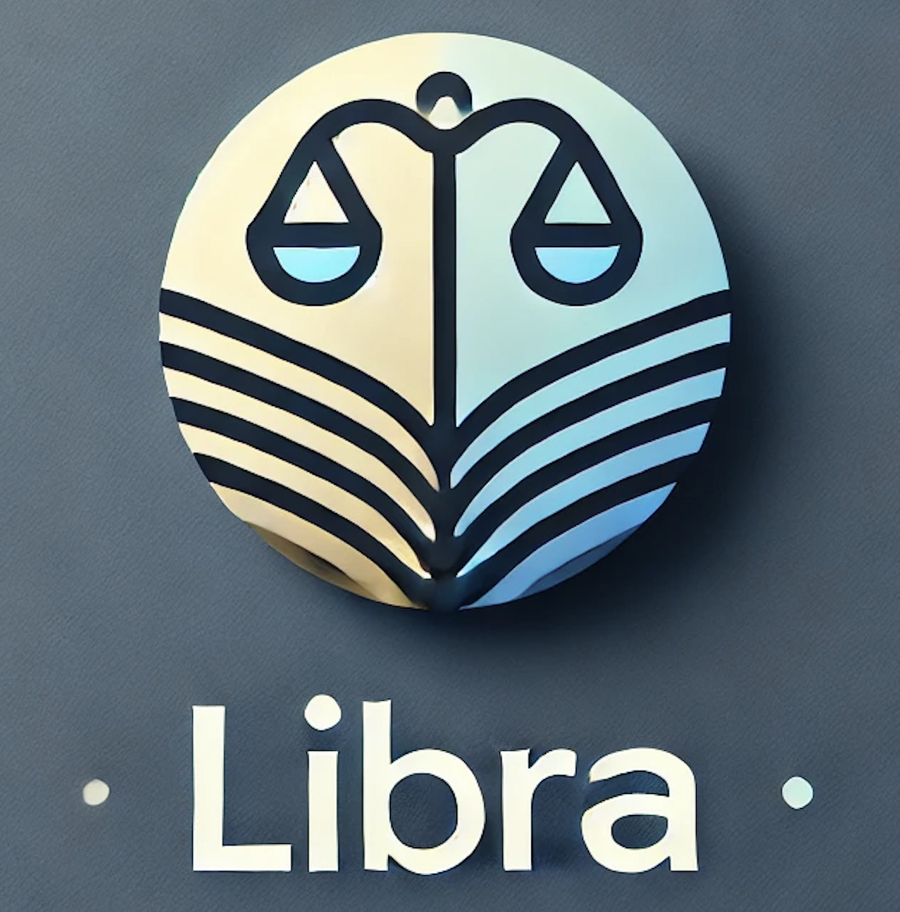

<h1 align="center">Libra</h1>

  

## :books: About
- Libra is a modern book-sharing platform that connects book lovers and builds reading communities. Users can borrow books from others, maintain their wishlists, write reviews, and engage with fellow readers. Built with a focus on fostering literary connections, this app creates a space where readers can share their favorite books and discover new ones through community recommendations.

## :fire: Getting Started
### [Deployed Link](https://libraa-f99a652e290b.herokuapp.com/)

  

## :computer: Technologies Used

## :electric_plug: Attributions:
### Font
- The modern and clean typography is powered by [TailwindCSS](https://tailwindcss.com/)'s font system.

### Icons
- Beautiful icons provided by [Heroicons](https://heroicons.com/), integrated through TailwindCSS.

### Images
- Background images provided by [Unsplash](https://unsplash.com/), a source of freely-usable images.
  - Library interior photo by [Fred Moon](https://unsplash.com/photos/0rVSHQoP4_4)

### Framework
- Frontend built with [React](https://reactjs.org/) and [TailwindCSS](https://tailwindcss.com/) for a responsive and modern UI
- Backend powered by [Express.js](https://expressjs.com/) and [Node.js](https://nodejs.org/)

### API 
- Book data and cover images from [OpenLibrary API](https://openlibrary.org/developers/api)

### Database 
- [MongoDB](https://www.mongodb.com/) with [Mongoose](https://mongoosejs.com/) ODM for data persistence
- [AWS S3](https://aws.amazon.com/s3/) for image storage

## :satellite: Upcoming Features
- AAU, I want to create reading groups where users can discuss books together
- AAU, I want to receive notifications when my borrowed books are due or when someone wants to borrow my books
- AAU, I want to track my reading progress and set reading goals
- AAU, I want to export my reading history and reviews
- AAU, I want to integrate with my Goodreads account to import my existing library
